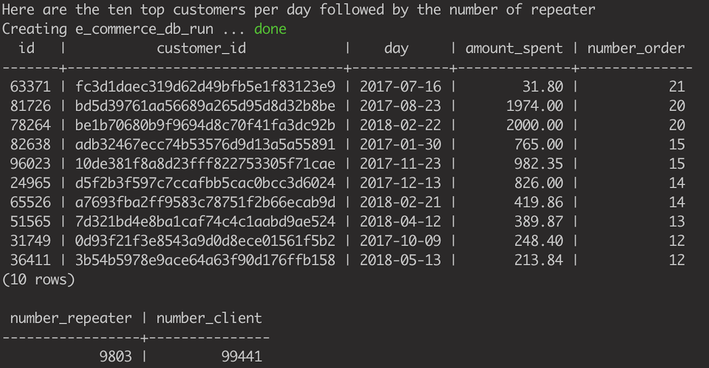

# TECHNICAL TEST : ANALYZE E-COMMERCE DATA

You were recently hired by an E-commerce company. Your mission is to provide insights on sales.

There are four datasets :
* *Products*: a list of available products.
* *Items*: a list of items.
* *Orders*: a list of customer orders on the website.
* *Customers*: a list of customers.

Centralize your projet and code in a Github repository and provide the url once the test is completed.

**To Dos**
1. Create and insert data in an local PostgreSQL.
2. Each day we want to compute summary statistics by customers every day (spending, orders etc.)
Create a script to compute for a given day these summary statistics.
3. Run that script over the necessary period to inject historic data. Then, identify the top customers
4. How many customers are repeaters ?
5. Package your script in Docker container so that it can be run each day. We expect a `docker-compose.yml` and a CLI to get stats for a specific day.


# README

This repository aims to answer the five requirements mentioned above. I pushed two main commits to propose two different approaches. <br>
Both of them are ready to be run.

## Table of contents
* [Setup](#Setup)
* [First version ; fully SQL](#first_version)
* [Second version ; Python x Postgres](#second_version)

## Setup

To run this project, docker has to be running. I used docker version 20.10.2. <br>
Then, clone this repository into your local machine and run inside the repository the following command:
```
$ sh bash_wrapper.sh
``` 
This bash file wraps all commands needed to produce the outputs.<br>
Be carefull, for volumes to be righltly mounted from your local machine into containers, the repository has to be cloned into some shared directories with Docker. By default the /Users, /Volume, /private, /tmp and /var/folders directory are shared. <br>
Also make sure that port 5432 on your local machine is not already used.<br>


## First version ; fully SQL

In this first version, I want to keep things simple. Therefore, only one container is needed : a postgres container where the database is run. <br>
Tables are created and populated inside this docker thanks to SQL codes. Afterwards, the daily stats are computed by batch and populate the customers_stats table. <br>
Top customers have been considered in terms of number of order rather than in terms of amount spent. This can be discussed. <br><br>



This version of the project satisfies all requirements but 5. (and 3. isn't totally satisfied as I created a script to compute the stats per day by batch, rather than looping over a daily script). <br>
Even if I think it is possible to dynamically include variables into SQL queries and make a Command Line Interface inside the postgres container. I decided to propose another version, that seems more suitable for furter and more complex data-enrichment tasks.

## Second version ; Python x Postgres

Here, I decided to build two containers :
* The same Postgres container to run the SQL database
* A Python container that communicates with the Postgres container to compute statistics daily.

I think, it is also interesting to see that from the first version to the second, only a few things changed in terms of code (cf commit second version ; Python x PostgreSQL). Even if conceptually, things have changed quite a lot. 

### Command Line interface

As soon as the bash_wrapper has been run, a user can compute statistics for a given day (here 2016-09-04) by running the following command :

```
$ Docker-compose run --rm dataengineering 2016-09-04
``` 
### Description of files and folders

The docker-compose.yml gives all the information about the two containers. The command ```
$ Docker-compose up``` is run inside the bash_wrapper.sh file. This executable also calls daily_stats_loop.sh, that uses a bash loop to iterate over the previous CLI on all days of the history. It also calls Python and SQL codes that are run in their respective container.<br>
Because looping the daily script over all days of the historic, is too long. I decide to just loop over the 4 first days to prove that everything is working. I first ran the following query :
```
SELECT MIN(order_purchase_timestamp), MAX(order_purchase_timestamp) FROM e_commerce.orders;
``` 
to get the min and max (2016-09-04 21:15:19 | 2077-08-15 07:55:36).
And then use a batch script (sql_code/batch_stats.sql) to populate the customers_stats table.

